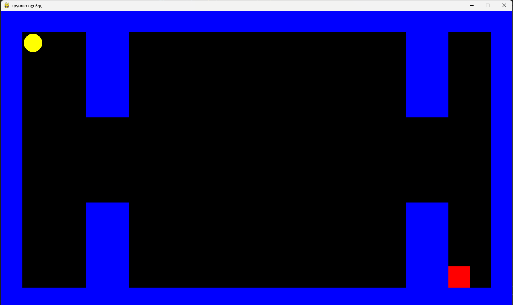
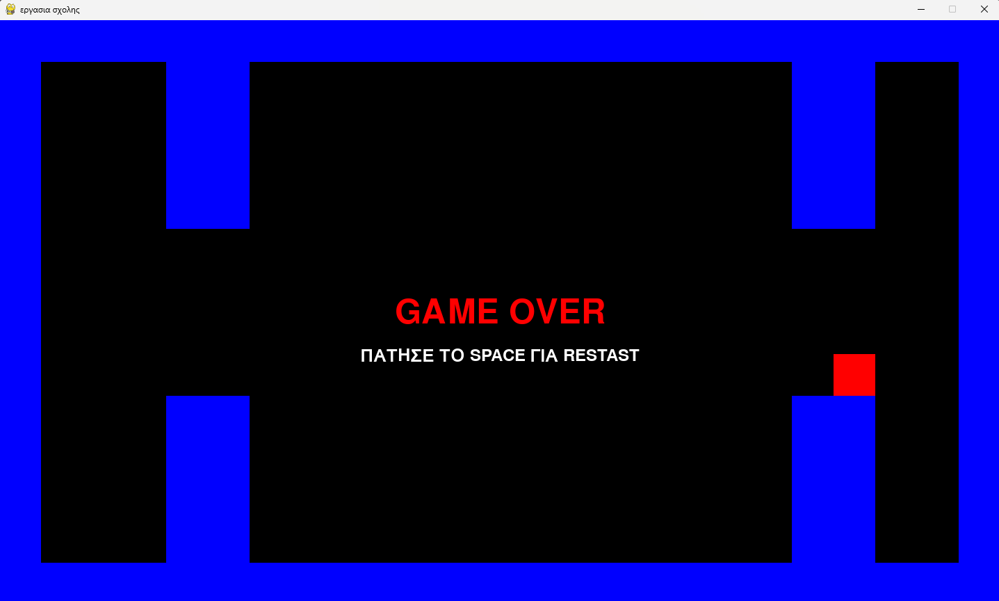

Εργασια Ιεκ pygame arcade

Περιγραφή Παιχνιδιού (σαν να το γράφεις εσύ)

Έφτιαξα ένα 2D arcade παιχνίδι με στυλ Pac-Man χρησιμοποιώντας την Python και τη βιβλιοθήκη Pygame.
Στο παιχνίδι, ο παίκτης κινείται μέσα σε έναν απλό χαρτη και με τα βελάκια του πληκτρολογίου και προσπαθεί να αποφύγει έναν εχθρό που τον κυνηγάει.
Αν ο εχθρός ακουμπήσει τον παίκτη, εμφανίζεται το μήνυμα GAME OVER και μπορώ να πατήσω το SPACE για να ξεκινήσει ξανά το παιχνίδι.

Τεχνικά χαρακτηριστικά που χρησιμοποίησα

Σχεδιασμός χάρτη:
Δημιούργησα το χάρτη ως λίστα από strings και τον σχεδιάζω με for loops, ώστε να φαίνονται οι τοίχοι στην οθόνη.

Αντικειμενοστραφής προγραμματισμός:
Έφτιαξα τις κλάσεις Pacman και Enemy για να χειρίζονται τον παίκτη και τον εχθρό.
Κάθε κλάση κρατάει τη θέση, την κίνηση και τη σχεδίαση του χαρακτήρα.

Κίνηση και σύγκρουση:
Ο παίκτης κινείται με τα βελάκια και ο εχθρός προσπαθεί να τον φτάσει. Όταν βρεθούν στο ίδιο μερος, ενεργοποιείται το Game Over.

Διαχείριση εισόδου χρήστη:
Ανιχνεύω τα πλήκτρα για κίνηση και για επανεκκίνηση του παιχνιδιού (SPACE).

Γραφικά και ήχος:
Ο χάρτης και οι χαρακτήρες σχεδιάζονται με απλά σχήματα (#, κύκλοι και τετράγωνα) και παίζει μουσική υπόβαθρου σε ολο το game.

Game Over με επανεκκίνηση:
Όταν τελειώνει το παιχνίδι, εμφανίζεται μήνυμα στην οθόνη και μπορώ να ξεκινήσω ξανά πατώντας το SPACE.

Εμαθα πώς να οργανώνω τον κώδικα με κλάσεις, να ελέγχω συγκρούσεις, να διαχειρίζομαι είσοδο χρήστη και να συνδυάζω γραφικά και ήχο.
